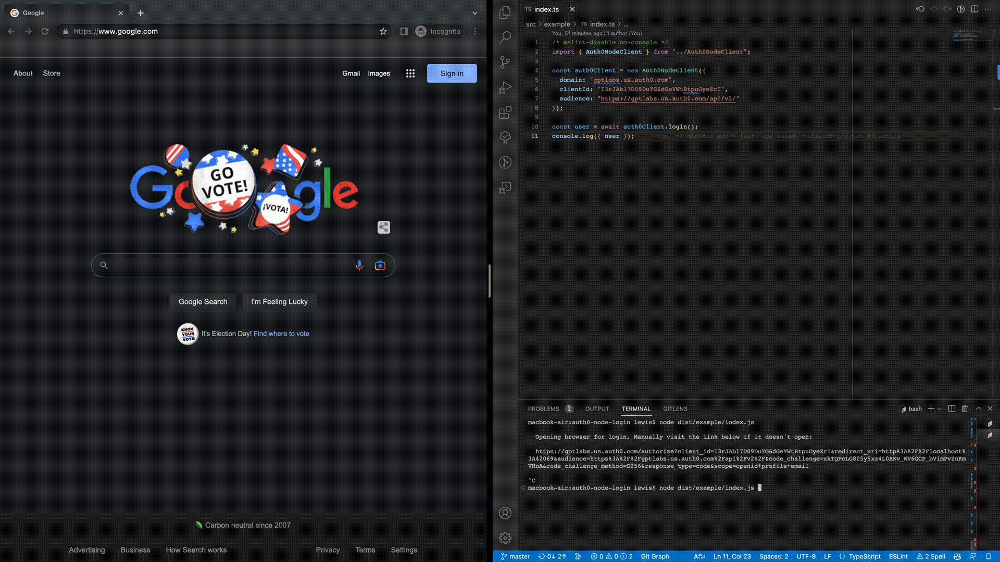

# Auth0 Node Client

A library for authenticating users of a Node program with traditional
browser-based Auth0 authorization flow. Recommended especially for CLIs.

### Prerequisites

This library uses a browser authorization code flow to authenticate a user. It
does this by starting a server locally, and setting the URL of that server as
the redirect location for the authorization process.

**You will need to add the client's redirect URL to <u>Applications >
[Application] > Allowed Callback URLs</u>.** The port can be overridden with the
`{ redirectPort }` config option, but by default, the callback URL is:

```
http://localhost:42069
```

### Usage

1. Create the Auth0 node client and export it for your program to use.
    ```ts
    // src/globs.ts

    export const AUTH0_CLIENT = new Auth0NodeClient({
      domain: "AUTH0_DOMAIN.us.auth0.com",
      redirectUri: "https://AUTH0_REDIRECT_URI",
      clientId: "AUTH0_CLIENT_ID",
      audience: "AUTH0_AUDIENCE",
      // redirectPort: 5555,
      // postLoginRedirect: "https://google.com",
    });
    ```

2. Import your client and use it to log in, log out, and make authenticated
   requests.

    ```ts
    // src/bin.ts
    import { AUTH0_CLIENT } from "./globs";

    /** Log in using the browser. **/
    await AUTH0_CLIENT.login();

    // Later:

    /**
     * Make authenticated requests. Authorization header set automatically.
     * 
     * Uses `node-fetch` under the hood to avoid runtime warnings.
     */
    await AUTH0_CLIENT.fetch(
      "http://my-api.com/endpoint", 
      { method: "POST", /* ... */ }
    );
    ```



### Caching

Access tokens will automatically be cached on disk and cleared once they expire.
Calls to `login(config)` will resolve instantly when the cache is valid.

### External use

This library's internals are also all exposed if you wish to use them more
granularly in some other context - `authorizeWithBrowser()`, `cacheToken()`,
etc.

### Acknowledgements

Thanks to @altostra, @yevk, and @ShlomiAltostra for their work on
[`altostra-cli-login-auth0`](https://github.com/altostra/altostra-cli-login-auth0),
which was helpful for reference on browser opening.

### Disacknowledgments

Unthanks to the Auth0 team for making OSS authors write this multiple times
rather than writing it for developers to use. Auth0 PKCE is not easy to debug by
hand!